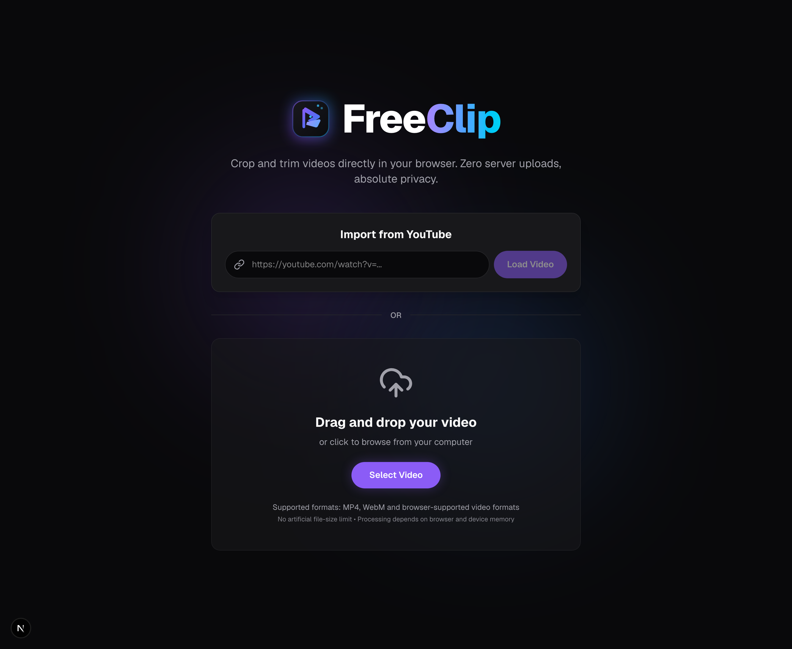
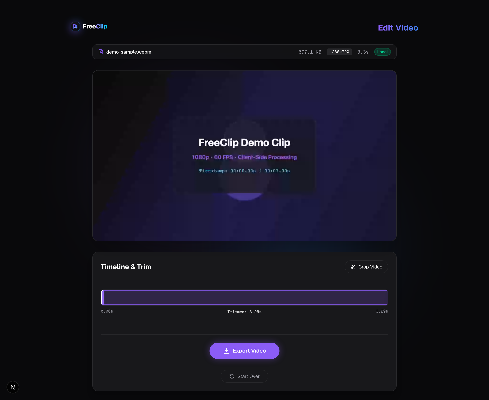
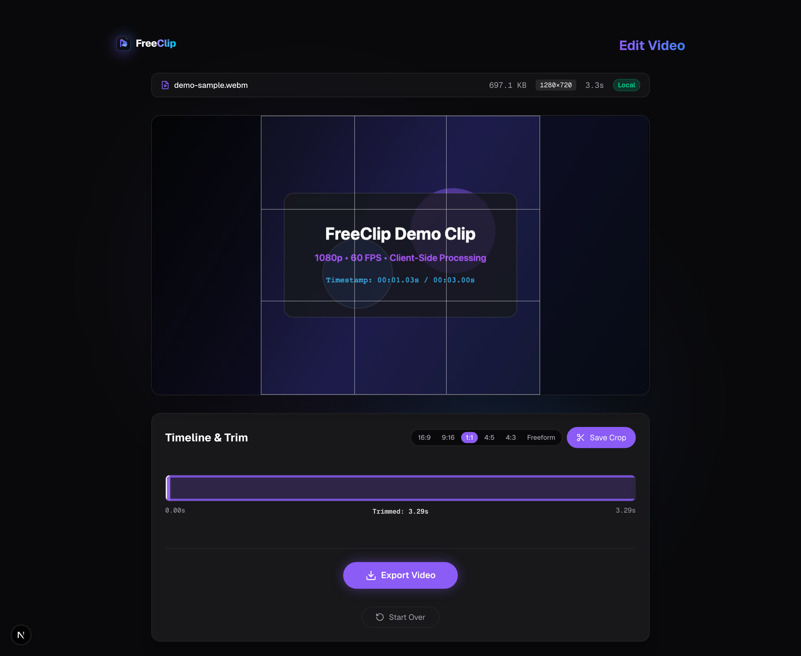
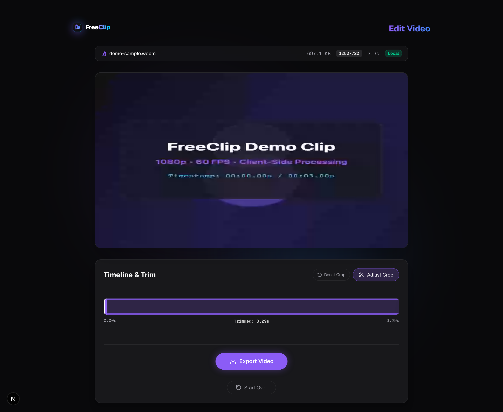
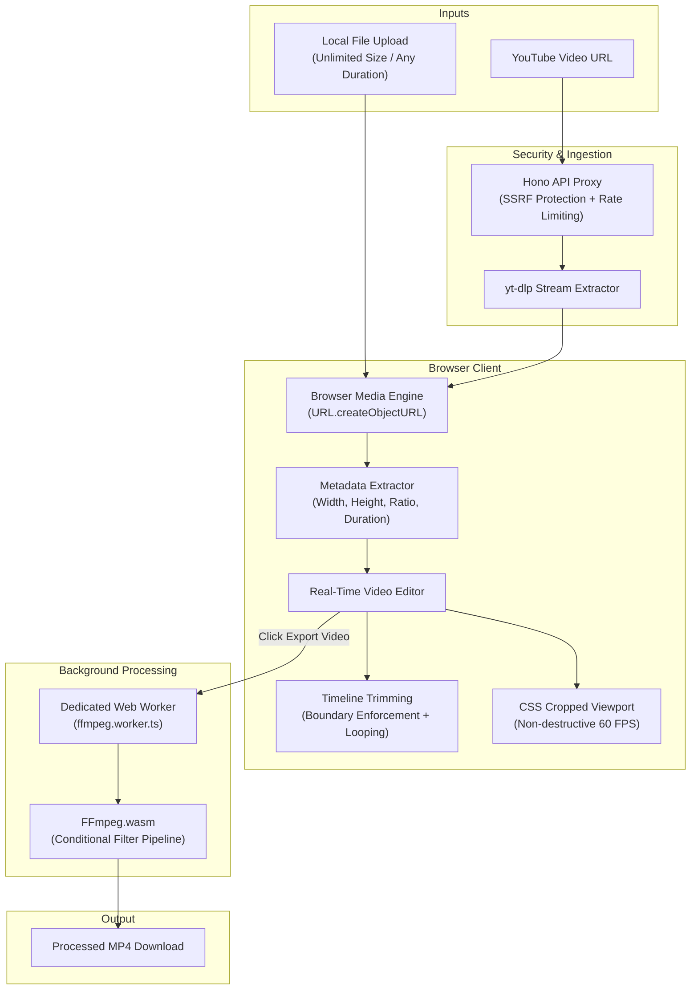

<div align="center">


### Modern, Browser-Native Video Editor
**Zero Server Uploads • Absolute Privacy • Unlimited File Sizes • Real-Time Previews**

[](https://nextjs.org/)
[](https://www.typescriptlang.org/)
[](https://tailwindcss.com/)
[](https://ffmpegwasm.netlify.app/)
[](https://hono.dev/)
[](https://vitest.dev/)
[](https://playwright.dev/)

</div>

---

## 📽️ Overview

**FreeClip** is a high-performance, client-side video editor that runs entirely inside your modern web browser. Designed for content creators, developers, and privacy-conscious users, FreeClip eliminates heavy cloud rendering costs, intrusive file uploads, and tedious sign-up walls.

Whether trimming a quick highlight, cropping a widescreen clip into a vertical TikTok/Reels short, or pulling footage directly from YouTube, FreeClip executes your edits in real-time with zero latency using browser hardware acceleration and compiles the final MP4 export locally using **FFmpeg.wasm**.

---

## 📸 Interface Preview

### 1. Home / Import Screen
Drag-and-drop local videos of any practical size or paste any YouTube URL through our secure, rate-limited streaming proxy.
<div align="center">
  
</div>

<br />

### 2. Video Editor & Interactive Timeline
Instant browser-native playback with real-time metadata detection (resolution, aspect ratio, duration, and file size), interactive trim handles, and seeking.
<div align="center">
  
</div>

<br />

### 3. Aspect Ratio Cropping & Rule-of-Thirds Grid
Non-destructive crop overlay featuring rule-of-thirds alignment grid and one-click aspect ratio presets: **16:9**, **9:16**, **1:1**, **4:5**, **4:3**, and **Freeform**.
<div align="center">
  
</div>

<br />

### 4. Real-Time Cropped Viewport Preview
Preview cropped videos in real time at 60 FPS using GPU-accelerated CSS viewports — no re-encoding or background processing required until you choose to export!
<div align="center">
  
</div>

---

## ✨ Key Features

- **🚀 Unlimited Local Video Input**: No artificial 50MB file size or 60-second duration limits. Upload videos of any practical size.
- **⚡ Instant Zero-Copy Preview**: Files load in under 50ms using `URL.createObjectURL(file)`. Video decoding is handled directly by browser media hardware.
- **🔒 100% Privacy & Zero Server Uploads**: Your local video files never leave your machine. Processing occurs locally in an isolated WebAssembly Web Worker.
- **✂️ Real-Time Timeline Trimmer**: Sub-second precision trim handles with automatic looping between selected start and end points.
- **📐 Non-Destructive Aspect Ratio Cropping**: Visual crop bounding box with presets for YouTube (`16:9`), TikTok/Reels/Shorts (`9:16`), Instagram Post (`1:1`, `4:5`), and Freeform.
- **🎞️ Conditional FFmpeg Filter Optimization**: Smart command builder applies only necessary filters (trim only, crop only, or trim + crop) to maximize export speed.
- **🛡️ WASM Memory Safeguards**: Protected against 32-bit WebAssembly 2GB memory ceiling with graceful error messages and automatic resource cleanup.
- **📺 YouTube Media Importer**: Secure SSRF-protected streaming proxy powered by Hono and `yt-dlp` with strict domain verification and rate limiting.
- **💎 Sleek Dark Mode UI**: Built with Tailwind CSS, custom glassmorphism, glowing accents, and responsive touch targets.

---

## 🏗️ Architecture & Pipeline



---

## 📁 Monorepo Structure

```text
freeclip-frontend/
├── apps/
│   ├── api/                       # Lightweight Hono backend proxy
│   │   ├── src/
│   │   │   ├── index.ts           # Streaming proxy, SSRF validation, rate limiting
│   │   │   └── __tests__/         # Vitest API integration tests
│   │   └── Dockerfile             # Container image with yt-dlp & FFmpeg
│   └── web/                       # Next.js 16 App Router frontend
│       ├── public/                # Static assets, SVG logos, favicons
│       ├── e2e/                   # Playwright end-to-end test suite
│       └── src/
│           ├── app/               # Next.js App Router (layout, pages, icon.svg)
│           ├── components/        # Logo, UploadZone, VideoEditor, TimelineTrimmer
│           ├── hooks/             # useFFmpeg, useYouTubeImport
│           └── workers/           # ffmpeg.worker.ts (WASM background worker)
├── packages/
│   └── shared/                    # Shared TypeScript domain contracts & utilities
│       ├── src/
│       │   ├── types.ts           # VideoMetadata, VideoSource, WorkerMessage
│       │   ├── validation.ts      # URL validation & SSRF defense patterns
│       │   └── ffmpeg/            # buildCommand.ts (conditional FFmpeg filters)
│       └── __tests__/             # Unit tests for shared logic
├── docs/
│   └── screenshots/               # High-resolution Retina UI screenshots
└── scripts/
    └── capture-screenshots.mjs    # Automated Playwright screenshot generator
```

---

## 🚀 Getting Started

### Prerequisites

- **Node.js**: `v20.0.0` or higher
- **npm**: `v9.0.0` or higher
- **yt-dlp**: Required for local YouTube stream extraction (`brew install yt-dlp` on macOS or `sudo apt install yt-dlp` on Linux)

### 1. Clone & Install Dependencies

```bash
git clone https://github.com/MrMajharul/FreeClip.git
cd FreeClip
npm install
```

### 2. Configure Environment Variables

```bash
# In apps/api
cp apps/api/.env.example apps/api/.env
```

Default configuration:
- `PORT=4000` (FreeClip API)
- `NEXT_PUBLIC_API_URL=http://localhost:4000` (Web app API target)

### 3. Start Development Servers

Run both the Next.js frontend and Hono API concurrently from the root:

```bash
npm run dev
```

- **Frontend**: [http://localhost:3000](http://localhost:3000)
- **API Health**: [http://localhost:4000/api/health](http://localhost:4000/api/health)

---

## 🧪 Testing & Quality Assurance

FreeClip maintains a test suite across all monorepo layers:

```bash
# Run all unit and integration tests (packages/shared, apps/api, apps/web)
npm test

# Run Playwright End-to-End tests
npm run test:e2e
```

### Test Coverage Summary

- **`@freeclip/shared`**: 36/36 tests passed (validation, SSRF checks, conditional command builder).
- **`@freeclip/api`**: 15/15 tests passed (health check, body size limits, rate limiting, error mapping).
- **`web`**: 25/25 tests passed (UploadZone validation, formatting, YouTube hook state machine).
- **Playwright E2E**: 10 passed across Chromium, Firefox, and WebKit.

---

## ⚡ Performance & Memory Design

| Video Size | Preview Load Time | Edit Interaction Latency | Browser Memory Overhead | Export Feasibility |
| :--- | :--- | :--- | :--- | :--- |
| **10 MB** (Short Clip) | < 50 ms | Instant (< 16 ms / 60 FPS) | ~15 MB | Fast (< 5s export) |
| **100 MB** (HD Video) | < 100 ms | Instant (< 16 ms / 60 FPS) | ~20 MB | Standard (~15-30s export) |
| **500 MB** (4K / Long Video) | < 200 ms | Instant (< 16 ms / 60 FPS) | ~35 MB | Feasible on modern desktop |
| **1 GB+** (Raw Footage) | < 400 ms | Instant (< 16 ms / 60 FPS) | ~40 MB | Protected by 2GB WASM memory guard |

> **Memory Safety Guarantee**: Video files are **never** stored as raw byte arrays in React state. Object URLs (`URL.createObjectURL`) point directly to file descriptors, and URLs are actively revoked via `URL.revokeObjectURL()` on component unmount and when resetting sessions.

---

## 🛠️ Production Build

To compile all workspaces for production:

```bash
npm run build
```

- `@freeclip/api`: Compiled via `tsc` to `dist/`
- `web`: Compiled via Next.js Turbopack with static page pre-rendering

---

## 📜 License

Distributed under the MIT License. See `LICENSE` for more details.
